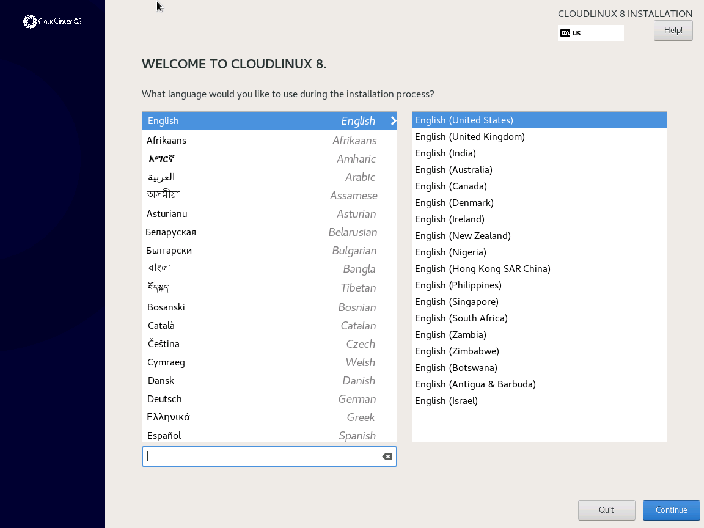
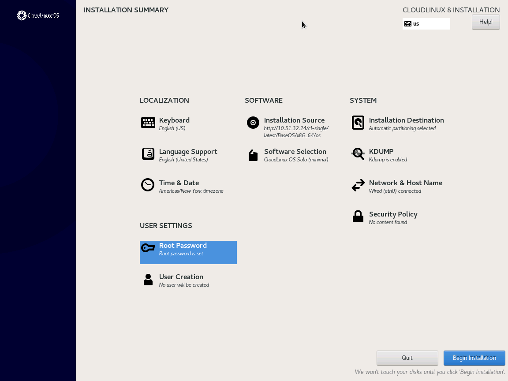
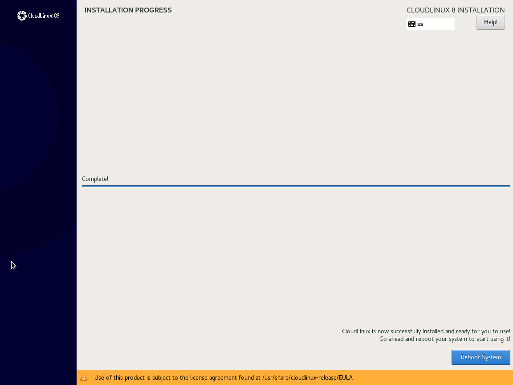

# Installation

[[toc]]


## Hardware compatibility

CloudLinux supports all the hardware supported by RHEL/CentOS, with few exceptions. 
Exceptions are usually hardware that require binary drivers, and that doesn't have any open source alternatives.

:::warning
CloudLinux OS Solo does not support ARM-based CPUs (e.g. Graviton)
:::


With RHEL 8 (**CloudLinux 8**), some devices are no longer supported. 
You can [check the entire list here](https://access.redhat.com/documentation/en-us/red_hat_enterprise_linux/8/html/considerations_in_adopting_rhel_8/hardware-enablement_considerations-in-adopting-rhel-8#removed-hardware-support_hardware-enablement).


## Fresh installation

### Downloading installation media

You can find download the latest ISO and use it to install 
CloudLinux OS Solo on your server using [this link](https://repo.cloudlinux.com/cloudlinux/8.3_solo_beta-netinstall/iso/x86_64/).

There are multiple ISO types available:

- CloudLinux-*-boot.iso - this ISO is made specifically for network installation and does not contain any packages inside.
- CloudLinux-*-dvd1.iso - this one contains all packages from network installation repository, 
  so you can set up any possible configuration without network access.
- CloudLinux-*-minimal.iso - this one contains only minimal set of packages to set up light server without GUI and Development tools.

* [https://www.repo.cloudlinux.com/cloudlinux/8/iso/x86_64/](https://www.repo.cloudlinux.com/cloudlinux/8/iso/x86_64/) - network/DVD installation ISOs

:::tip Note
Once you install server from the ISO, make sure you [register your system](/cloudlinux_installation/#license-activation) 
and then run `yum update` to get all recent updates.
:::


### Installing in the Graphical User Interface

The graphical installation interface is the preferred method of manually installing CloudLinux OS Solo. 
It allows you full control over all available settings, including disk partitioning and storage configuration.

The graphical mode is used by default when you boot the system from local media.

### Language Selection

The first screen displayed is language selection page.



First, find your preferred language in the left column and than select locale in the right one.
Selected language will be used during installation and also as default language of installed system.

After you select your language and locale, click `Continue` to confirm your selection 
and proceed to [Installation Summary](#installation-summary). 

### Installation summary

The Installation Summary screen is the main dashboard of your installation parameters. 
Most of the options which can be configured during the installation can be accessed from here.


The summary screen displays links to other configuration screens, those links can be in 
several different states, which are graphically indicated:

- Grayed out link means that installer is currently updating this sections. 
  Please wait a little before accessing this section. 

- A warning symbol next to an icon means that a screen requires your attention before you start the installation.

- Links without warning symbol mean that screen does not require your attention. 
  You can still change your settings in these screens, but it is not required to start installation.

### Installation Source

The first thing that you should define is where system will be installed from.
There are basically two options:

- ISO file
- On the network

#### On the network source

Use this option to download packages to be installed from a network location. 
This is the preferred way as you automatically receive all critical bug fixes that may affect installation.

:::tip Note
Most likely your network is not configured by default, 
so you can see url configuration field greyed out, like on screenshot below. 


Please refer to Network Configuration screen first to set up a network connection.
:::

The right installation url for CloudLinux OS Solo is
```text
https://repo.cloudlinux.com/cloudlinux/8.3_solo_beta-netinstall/BaseOS/x86_64/kickstart/
```

Type in installation url in the corresponding field, configure proxy if needed and press `Done` button.


#### ISO file source

This option is primary used as an alternative when you don't have internet connection on target server.
It is only available if you downloaded Minimal or DVD iso which contain some bundled packages in.


Choose `ISO file` checkbox and press `Done` button.

#### Next steps
After clicking `Done`, you will be redirected to the [Installation Summary](./#installation-summary) screen
where [Installation source](./#installation-source) and [Software Selection](./#software-selection) links
will be greyed and show `Downloading package metadata` message. 


Please hold on while while that message disappears and 
proceed to the [Software Selection](./#software-selection) section.


#### Software Selection

The Software Selection screen allows you to choose a Base Environment and Add-ons. 
These options control which software packages will be installed on your system during the installation process.

This screen is only available if Installation Source is properly configured and only after the installer 
has downloaded package metadata from the source.

It is not possible to select specific packages during a manual installation, you can only select pre-defined environments and add-ons. 


To install CloudLinux OS Solo, first choose the `CloudLinux OS Solo (minimal)` environment on the left of the screen.
:::warning Warning
All other environments are used to install [CloudLinux OS Shared](http://docs.cloudlinux.com/), so make sure you choose `CloudLinux OS Solo (minimal)`. 
::: 
Only one environment can be chosen, even if more are available. 

Then, on the right side of the screen, select one or more add-ons which you want to install by marking the check boxes next to each add-on.

#### Final preparations

Installation is almost done, all you need to do is [configure your installation target](https://access.redhat.com/documentation/en-us/red_hat_enterprise_linux/7/html/installation_guide/sect-disk-partitioning-setup-x86)
using `Installation Destination` menu and create your [Root Password](https://access.redhat.com/documentation/en-us/red_hat_enterprise_linux/7/html/installation_guide/sect-configuration-progress-menu-x86#sect-account-configuration-x86).

Doing that, `Begin installation` button becomes blue, so click it.

 

After this point, the installation process actually starts and changes are being made to your selected disks.
It is not possible to go back to the Installation Summary and change any settings configured there; 
if you need to do so, you must wait for the installation process to finish, reboot your system, log in and change your settings 
on the installed system.

The bottom of the screen shows a progress bar and a message informing you of the current progress of the installation. 
When the installation finishes, you can press the Finish installation button
to reboot your computer and log in to your newly installed system.

:::warning
Before you finish the installation and reboot, either remove the media
which you used to start the installation, or make sure that your system tries to boot 
from the hard drive before trying removable media. 

Otherwise, your computer will start the installer again instead of the installed system.


:::

#### Next steps

Reboot your system, login and check EULA which is located in `/usr/share/cloudlinux-release/EULA`.

Next, [activate your installation](/manager/#activation) in order to get updates.


## Converting existing servers

Sometimes it is required to convert already existing servers with `CentOS` or `AlmaLinux` and make them `CloudLinux OS Solo`.

It is easy to convert your existing installation by cldeploy script. The process takes a few minutes and replaces just a handful of RPMs.

:::warning
Unlike [Fresh installation](./#fresh-installation), converting requires CloudLinux OS Solo license. 
Please refer to the [guide](/activation/) to get activation key.
:::

If you have an activation key, run the following commands:
```
yum install wget -y
wget https://repo.cloudlinux.com/cloudlinux/sources/cln/cldeploy
bash cldeploy -k ACTIVATION_KEY
```
Where `ACTIVATION_KEY` is the one that you get on previous step.


After successful conversion, reboot your system by running the following command:

```
reboot
```

The script automatically detects and supports the following control panels:
* cPanel with Easy Apache 4

Unfortunately, for now is is not available to convert servers with:
* Plesk
* DirectAdmin
* Other control panels that use [CloudLinux OS Shared integration](https://docs.cloudlinux.com/control_panel_integration/#introduction).

Please subscribe to [our blog](https://blog.cloudlinux.com/), check news and receive updates. 


:::tip cldeploy explained

By its design, CloudLinux OS Solo is very close to the upstream operating system, RHEL (and so, CentOS and AlmaLinux). 
This makes the conversion process relatively straightforward, requiring just one reboot. 

Here's what the cldeploy script does when you run it:

* Backups the original repository settings into <span class="notranslate">`/etc/cl-convert-saved`</span>.
* Backups RHEL system ID into <span class="notranslate">`/etc/cl-convert-saved`</span> (RHEL systems only).
* Installs CloudLinux repository settings and imports CloudLinux RPM key.
* Replaces redhat/centos-release, redhat-release-notes, redhat-logos with CL version.
* Re-installs CL version of rhnlib/rhnplugin.
* Checks for binary kernel modules, finds replacement if needed.
* Detects OVH servers and fixes mkinitrd issues.
* Detects Linode servers and fixes grub issues.
* Checks if LES is installed.
* Checks that <span class="notranslate">`/etc/fstab`</span> has correct <span class="notranslate">`/dev/root`</span>
* Checks for efi.
* Installs CloudLinux Manager for cPanel Solo.
:::


