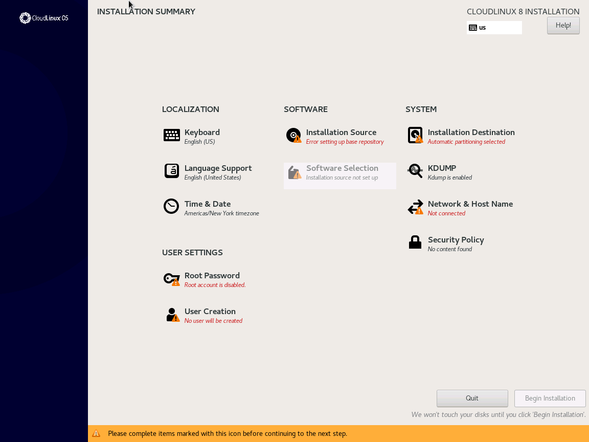
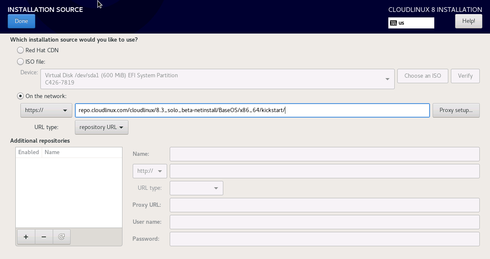

# Installation

[[toc]]


## Hardware compatibility

CloudLinux OS Solo supports all the hardware supported by RHEL/CentOS, with few exceptions. 
Exceptions are usually hardware that require binary drivers, and that doesn't have any open source alternatives.

:::warning
CloudLinux OS Solo does not support ARM-based CPUs (e.g. Graviton)
:::


With RHEL 8 (**CloudLinux 8**), some devices are no longer supported. 
You can [check the entire list here](https://access.redhat.com/documentation/en-us/red_hat_enterprise_linux/8/html/considerations_in_adopting_rhel_8/hardware-enablement_considerations-in-adopting-rhel-8#removed-hardware-support_hardware-enablement).


## Fresh installation

### Downloading installation media

You can download the latest ISO and use it to install 
CloudLinux OS Solo on your server using [this link](https://repo.cloudlinux.com/cloudlinux/8.3_solo_beta-netinstall/iso/x86_64/).

There are multiple ISO types available:

* `CloudLinux-*-boot.iso` - this ISO is made specifically for network installation and does not contain any packages inside.
* `CloudLinux-*-dvd1.iso` - this one contains all packages from network installation repository, 
  so you can set up any possible configuration without network access.
* `CloudLinux-*-minimal.iso` - this one contains only minimal set of packages to set up light server without GUI and Development tools.

[https://www.repo.cloudlinux.com/cloudlinux/8/iso/x86_64/](https://www.repo.cloudlinux.com/cloudlinux/8/iso/x86_64/) - network/DVD installation ISOs

:::tip Note
Once you install server from the ISO, make sure you [register your system](/cloudlinux_installation/#license-activation) 
and then run the `yum update` command to get all recent updates.
:::


### Installing in the Graphical User Interface

The graphical installation interface is the preferred method of manually installing CloudLinux OS Solo. 
It allows you to have full control over all available settings, including disk partitioning and storage configuration.

The graphical mode is used by default when you boot the system from the local media.

### Language selection

The first screen displayed is the language selection page.


First, find your preferred language in the left column and than select locale in the right one.
Selected language will be used during installation and also as a default language of the installed system.

After you select your language and locale, click `Continue` to confirm your selection 
and proceed to the [Installation Summary](#installation-summary). 

### Installation summary

The Installation summary screen is the main dashboard of your installation parameters. 
Most of the options which can be configured during the installation can be accessed from here.



The summary screen displays links to other configuration screens, those links can be in 
several different states, which are graphically indicated:

- Grayed out link means that the installer is currently updating this sections. 
  Please wait a little before accessing this section. 

- A warning symbol next to an icon means that a screen requires your attention before you start the installation.

- Links without warning symbol mean that screen does not require your attention. 
  You can still change your settings in these screens, but it is not required to start installation.

### Installation Source

The first thing that you should define is where the system will be installed from.
There are basically two options:

- ISO file
- On the network

#### On the network source

Use this option to download packages to be installed from a network location. 
This is the preferred way as you automatically receive all critical bug fixes that may affect installation.

:::tip Note
Most likely your network is not configured by default, 
so you can see the URL configuration field greyed out, like on the screenshot below. Please refer to the Network Configuration screen first to set up a network connection.
:::


The correct installation URL for CloudLinux OS Solo is

```text
https://repo.cloudlinux.com/cloudlinux/8.3_solo_beta-netinstall/BaseOS/x86_64/kickstart/
```

Type in installation URL in the corresponding field, configure proxy if needed and press the `Done` button.




#### ISO file source

This option is primary used as an alternative when you don't have internet connection on a target server.
It is only available if you downloaded Minimal or DVD ISO which contains some bundled packages in.


Tick the `ISO file` checkbox and press the `Done` button.

#### Next steps

After clicking `Done`, you will be redirected to the [Installation Summary](./#installation-summary) screen
where [Installation source](./#installation-source) and [Software Selection](./#software-selection) links
will be greyed and the `Downloading package metadata` message wll be shown. 


Please hold on while that message disappears and proceed to the [Software Selection](./#software-selection) section.


#### Software Selection

The Software Selection screen allows you to choose a Base Environment and Add-ons. 
These options control which software packages will be installed on your system during the installation process.

This screen is only available if Installation Source is properly configured and only after the installer 
has downloaded package metadata from the source.

It is not possible to select specific packages during a manual installation, you can only select pre-defined environments and add-ons.

To install CloudLinux OS Solo, first, choose the `CloudLinux OS Solo (minimal)` environment on the left of the screen.

:::warning Warning
All other environments are used to install [CloudLinux OS Shared](http://docs.cloudlinux.com/), so make sure you choose `CloudLinux OS Solo (minimal)`. 
:::

Only one environment can be chosen, even if more are available. 

Then, on the right side of the screen, select one or more add-ons which you want to install by ticking the check boxes next to each add-on.

#### Final preparations

Installation is almost done, all you need to do is to [configure your installation target](https://access.redhat.com/documentation/en-us/red_hat_enterprise_linux/7/html/installation_guide/sect-disk-partitioning-setup-x86)
using the `Installation Destination` menu and create your [Root Password](https://access.redhat.com/documentation/en-us/red_hat_enterprise_linux/7/html/installation_guide/sect-configuration-progress-menu-x86#sect-account-configuration-x86).

Doing that, the `Begin installation` button becomes blue, so click it.

 

After this point, the installation process actually starts and changes are being made to your selected disks.
It is not possible to go back to the Installation Summary and change any settings configured there; 
if you need to do so, you must wait for the installation process to finish, reboot your system, log in and change your settings 
on the installed system.

The bottom of the screen shows a progress bar and a message informing you of the current progress of the installation. 
When the installation finishes, you can press the Finish installation button
to reboot your computer and log in to your newly installed system.

:::warning Warning
Before you finish the installation and reboot, either remove the media
which you used to start the installation, or make sure that your system tries to boot 
from the hard drive before trying removable media. Otherwise, your computer will start the installer again instead of the installed system.
:::


#### Next steps

Reboot your system, login and check EULA which is located in the `/usr/share/cloudlinux-release/EULA`.

Next, [activate your installation](/manager/#activation) in order to get updates.


## Converting existing servers

Sometimes it is required to convert already existing servers with `CentOS` or `AlmaLinux` and make them `CloudLinux OS Solo`.

It is easy to convert your existing installation by cldeploy script. The process takes a few minutes and replaces just a handful of RPMs.

:::warning
Unlike [Fresh installation](./#fresh-installation), converting requires CloudLinux OS Solo license. 
Please refer to the [guide](/activation/) to get activation key.
:::

### Downloading and running conversion script

If you already have an activation key, run the following commands:

```
yum install wget -y
wget https://repo.cloudlinux.com/cloudlinux/sources/cln/cldeploy
bash cldeploy -k ACTIVATION_KEY
```

Where `ACTIVATION_KEY` is the one that you got on previous step.


After successful conversion, reboot your system by running the following command:

```
reboot
```

The script automatically detects and supports the following control panels:
* cPanel with Easy Apache 4

Unfortunately, for now is is not possible to convert servers with:

* Plesk
* DirectAdmin
* Other control panels that use [CloudLinux OS Shared integration](https://docs.cloudlinux.com/control_panel_integration/#introduction).

Please subscribe to [our blog](https://blog.cloudlinux.com/), check news and receive updates. 

#### The cldeploy explanation

By its design, CloudLinux OS Solo is very close to the upstream operating system, RHEL (and so, CentOS and AlmaLinux). 
This makes the conversion process relatively straightforward, requiring just one reboot. 

Here's what the cldeploy script does when you run it:

* Backups the original repository settings into the`/etc/cl-convert-saved`.
* Backups RHEL system ID into the `/etc/cl-convert-saved` (RHEL systems only).
* Installs CloudLinux repository settings and imports CloudLinux RPM key.
* Replaces redhat/centos-release, redhat-release-notes, redhat-logos with CloudLinux version.
* Re-installs CloudLinux version of rhnlib/rhnplugin.
* Checks for binary kernel modules, finds replacement if needed.
* Detects OVH servers and fixes the mkinitrd issues.
* Detects Linode servers and fixes the grub issues.
* Checks if LES is installed.
* Checks that the `/etc/fstab` has correct `/dev/root`.
* Checks for efi.
* Installs CloudLinux Manager for cPanel Solo.

### Next steps

Reboot your system, login and check EULA which is located in the `/usr/share/cloudlinux-release/EULA`.

## Uninstalling

You can always uninstall CloudLinux OS Solo. In this case, the system will be converted back to CentOS or
AlmaLinux.

The following actions will be taken:

* CloudLinux repositories & yum plugin will be removed.
* CentOS or AlmaLinux repositories will be set up.

In the end, the script will provide instructions on how to finish the conversion back. 
That will require removal of CloudLinux kernel (manual step), and installation of CentOS or AlmaLinux kernel (if needed).

:::warning
Do not forget to free up a CloudLinux OS Solo license by removing the server from the [Servers section of your CLN account](https://docs.cln.cloudlinux.com/dashboard/#servers)
After that, if you don't intend to use the license anymore, you can [remove it](https://docs.cln.cloudlinux.com/dashboard/#cloudlinux-os-activation-keys) to avoid being billed for it.
:::

To uninstall CloudLinux OS, run:

```
wget -O cldeploy https://repo.cloudlinux.com/cloudlinux/sources/cln/cldeploy
sh cldeploy -c
```

Now you have converted back and it is the time to install kernel.
To delete CloudLinux kernel, run (change the kernel package name to the one you've been using):

```
rpm -e --nodeps kernel-2.6.32-673.26.1.lve1.4.27.el6.x86_64
```

To install new CentOS or AlmaLinux kernel once you deleted CloudLinux kernel, type

```
yum install kernel
```
If yum says that the latest kernel is already installed, it is OK.
Please check your bootloader configuration before rebooting the system.

To remove unused kmods and lve libs run:
```
yum remove lve kmod*lve*
```

Before the reboot, the following command should be executed for restoring Apache and httpd.conf without mod_hostinglimits:

*For EasyApache 3:*
```
/scripts/easyapache --build
```

*For EasyApache 4:*
```
/usr/local/bin/ea_install_profile --install /etc/cpanel/ea4/profiles/cpanel/default.json
```

:::tip Note
Some packages from CloudLinux repo will still remain. They are the same as CentOS or AlmaLinux packages, and don't have to be removed. 
They will be updated in the future from CentOS repositories, as new versions come out.
:::